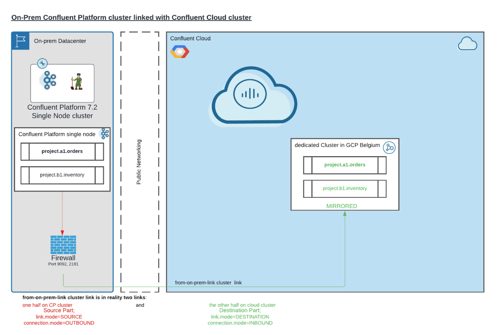
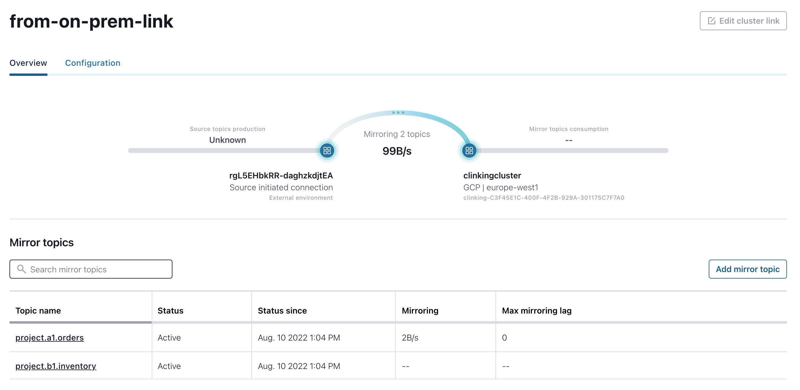

# Confluent Cluster Linking from on-prem to Confluent Cloud

This demo shows how to implement a hybrid setup to replicate data from Confluent Platform Cluster on-prem to Confluent Cloud for a migration use case.
We will use source-initiated cluster links which avoid a communication from cloud to on-prem. We will communicate from on-prem to cloud.
My Demo Setup looks like this:


If everything is up and running we will mirror two topics from source to cloud cluster. The cloud UI will show us the setup


## reprequisites to run this demo
* confluent cli is installed
* java 11 is installed and JAVA_HOME is configured
* you have a confluent cloud account
* we will need some utilities like wget, tar
* my environment is MacOS, a linux setup should work as well

## run Demo
The demo will install Confluent Platform 7.2.1. If you have this setup already, please change the CONFLUENT_HOME and JAVA_HOME in the script. If CP is not installed your desk then uncomment the installation in the script `00_setup_onprem_ccloud_linking.sh` (and set the corrent path where to install):
```bash
#download software Confluent Software
cd WHERETOINSTALL
wget https://packages.confluent.io/archive/7.2/confluent-7.2.1.tar.gz
tar -xvf confluent-7.2.1.tar.gz
rm confluent-7.2.1.tar.gz
rm confluent
ln -s confluent-7.2.1/ confluent
# set environment
export CONFLUENT_HOME=YOURPATH
#export CONFLUENT_CONFIG=$CONFLUENT_HOME/etc/kafka
# set Java11
export JAVA_HOME=YOURPATH
```
The demo will create then a dedicated cluster in confluent cloud. This will generate costs on your side. Please be aware.

Download this repo
```bash
git clone https://github.com/ora0600/hybridcloud-confluent-cluster-migration.git
cd hybridcloud-confluent-cluster-migration/
```

Change `export CONFLUENT_HOME=/Users/confluent/software/confluent` to you own installation path in script `00_setup_onprem_ccloud_linking.sh`.
run the demo setup script
```bash
./00_setup_onprem_ccloud_linking.sh
```
During the installation you have tio interact twice:
1. `>> please check errors on console, if so stop here (CTRL+C).If no errors, continue with dedicated cluster creation by PRESSING ENTER...`here you need to enter ENTER if no errors are visable. This is after starting the zookeeper and brokr on your desktop (on-prem cluster)
2. `>> 30 minutes are over, please check dedicated cluster is runing, then PRESS ENTER...` After creating the dedicated cluster. Please check if cluster is visable. It could be that cluster provisioing need more time. The istallation file wait 30 minutes. If cluster is created and is up and running, then press ENTER.

Now, you can play around with setup. Be aware that a dedicated cluster in Confluent Cloud will costs some dollars per hour.

The Confluent Cloud UI will show the mirrored to topics.


## Stop demo
to stop everything run this script
```bash
./02_delete_onprem_ccloud_linking_env.sh
```

# License
The Confluent Platform running on one node only as a Lab does not need a license from Confluent. Confluent called this [Developer License](https://docs.confluent.io/platform/current/installation/license.html#developer-license). The Confluent Cloud generate costs based on usage. If you start a dedicated clsuter this will costs a couple of dollars by hours. Please check you own rate card in your Confluent Cloud Billing app. In my account I pay ~2.54$ per hour for a 1 CKU dedicated cluster with Internet endpoints running in GCP Belgium.